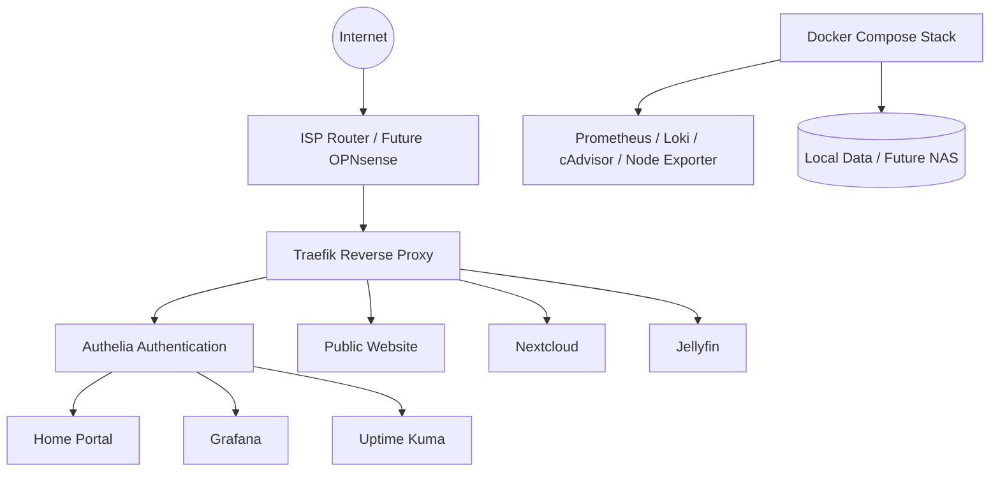

# CHOMS-HOMELAB

> Production-inspired self-hosted infrastructure platform built with Debian, Docker, Traefik, Authelia, monitoring, custom operational tooling and a roadmap toward resilient homelab infrastructure.


## What is CHOMS-HOMELAB?

CHOMS-HOMELAB is a long-term infrastructure project designed as a real-world Systems Administration, Infrastructure Engineering and DevOps laboratory.

The goal is not simply to run services. The goal is to build, operate and document a reproducible platform with production-inspired practices:

- Infrastructure as code mindset
- Git as source of truth
- Modular Docker Compose architecture
- Secure public and private service exposure
- Centralized authentication
- Monitoring and observability
- Operational CLI tooling
- Documented decisions and roadmap
- Progressive path toward NAS, backups, CI/CD, clustering and automation

## Current Status

| Area | Status |
|---|---|
| Phase 1 Foundation Infrastructure | Completed |
| GitHub repository | Clean and versioned |
| Docker Compose modularization | Completed |
| Traefik reverse proxy | Completed |
| Authelia authentication | Completed |
| HTTPS routing | Completed |
| Public website | Completed |
| Monitoring stack | Completed |
| CHOMS CLI | Completed |
| CHOMS Doctor / Health | Completed |
| Documentation baseline | Completed |
| Phase 2 Backups and Resilience | Ready to start |

Current release tag:

```text
v1.0.0-phase1
```

## High-Level Architecture



## Public and Protected Services

### Public

- `https://chomsmaster.com`
- `https://www.chomsmaster.com`

### Authentication

- `https://auth.chomsmaster.com`

### Protected by Authelia

- `https://home.chomsmaster.com`
- `https://grafana.chomsmaster.com`
- `https://kuma.chomsmaster.com`
- `https://traefik.chomsmaster.com`

### Native Login Applications

- `https://cloud.chomsmaster.com`
- `https://jellyfin.chomsmaster.com`

## Technology Stack

### Base Infrastructure

- Debian 13
- Docker
- Docker Compose
- UFW
- Fail2ban
- WireGuard

### Routing and Security

- Traefik
- Let's Encrypt
- Authelia
- Pi-hole

### Monitoring and Observability

- Grafana
- Prometheus
- Loki
- Promtail
- cAdvisor
- Node Exporter
- Uptime Kuma
- Scrutiny

### Data and Applications

- PostgreSQL
- MariaDB
- Nextcloud
- Jellyfin
- Nginx public site

### Operations

- CHOMS CLI
- CHOMS Doctor
- CHOMS Health
- CHOMS Vault wrapper
- CHOMS Compose wrapper
- CHOMS service utilities

## CHOMS CLI

The project includes its own operational CLI:

```bash
choms help
choms health
choms status
choms doctor
choms version
choms urls
choms compose ps
choms compose up -d
choms compose config
choms service list
choms service status
choms service restart <service>
choms service logs <service>
choms logs <service>
choms restart <service>
choms update
choms vault list
choms vault show <service>
```

CLI structure:

```text
tools/choms
tools/commands/
```

## Docker Compose Architecture

The Compose stack is modularized:

```text
docker/
├── compose.yml
└── compose/
    ├── core.yml
    ├── authelia.yml
    ├── monitoring.yml
    ├── cloud.yml
    ├── media.yml
    └── databases.yml
```

Use:

```bash
choms compose ps
choms compose config
choms compose up -d
```

Avoid manually invoking long Docker Compose file chains unless debugging.

## Operational Validation

Expected Phase 1 validation commands:

```bash
git status
git tag | grep phase
choms health
choms status
choms compose config
choms compose ps
curl -I https://chomsmaster.com
curl -I https://www.chomsmaster.com
```

Expected result:

- Repository clean
- Tag `v1.0.0-phase1` present
- CHOMS Health OK
- CHOMS Doctor 100%
- Compose config valid
- Core containers running
- Public website returning HTTP 200

## Roadmap

### Phase 1 — Foundation Infrastructure

Status: Completed

Delivered:

- Debian 13 base host
- Docker and Compose
- Modular Compose layout
- Traefik
- Authelia
- HTTPS
- Public website
- Protected dashboards
- Monitoring stack
- CHOMS CLI
- CHOMS Doctor / Health
- GitHub repository and documentation baseline

### Phase 2 — Backups, Resilience and Recovery

Status: Ready to start

Planned:

- NAS design
- Disk inventory and SMART audit
- ZFS / TrueNAS or Debian + ZFS decision
- `choms backup`
- `choms restore`
- automated backup schedule
- backup verification
- recovery runbooks

### Phase 3 — Service Expansion

Planned:

- Vaultwarden
- Gitea
- n8n
- Immich
- additional automation services

### Phase 4 — Cluster Preparation

Planned:

- multiple mini PC nodes
- node inventory
- WireGuard node-to-node connectivity
- service placement strategy
- K3s evaluation
- distributed monitoring
- CI/CD deployment flow

## Project Goal

CHOMS-HOMELAB is intended to become a practical, portfolio-grade infrastructure platform demonstrating:

- Linux administration
- Docker operations
- networking
- security
- monitoring
- automation
- documentation
- systems architecture
- recovery planning

## Author

Oscar Salcedo  
Founder — CHOMS Master Technology Services
