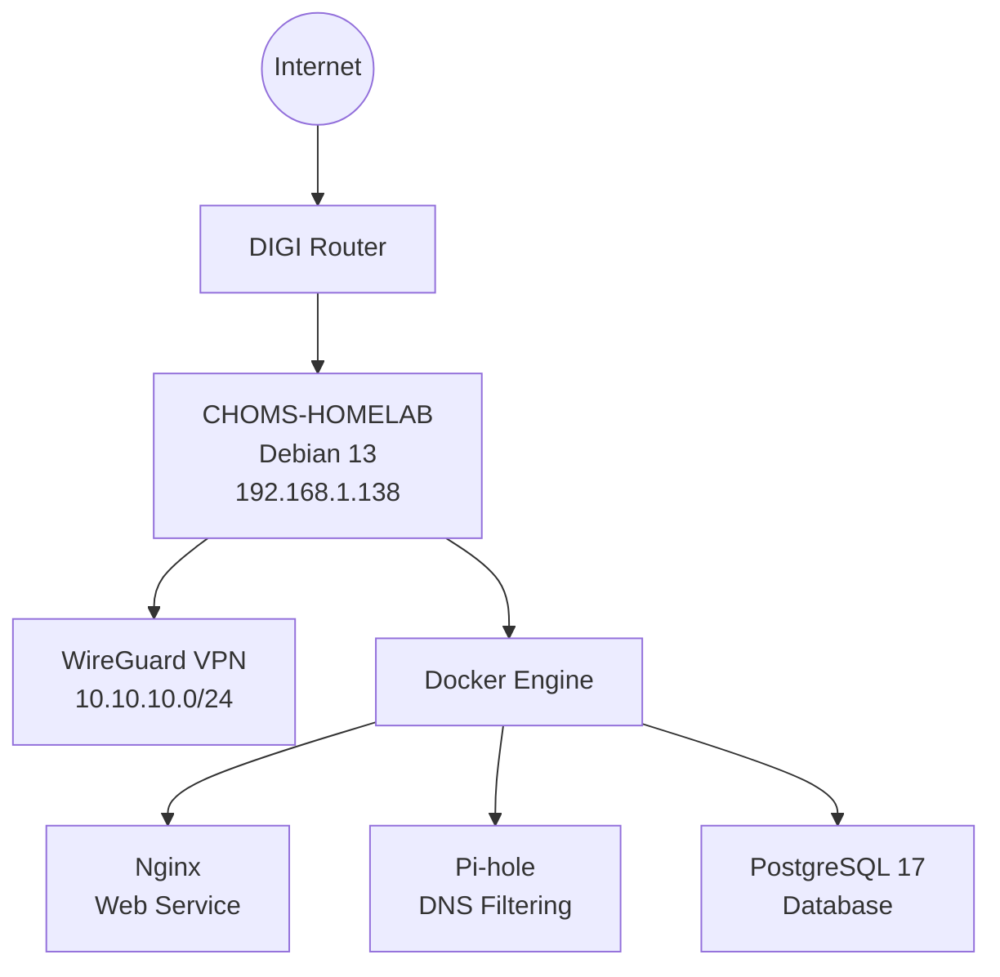

# CHOMS-HOMELAB

> Self-hosted Infrastructure & Technology Platform


CHOMS-HOMELAB is a self-hosted infrastructure platform designed and maintained as a real-world systems administration and backend engineering project.

Originally created to replace recurring hosting costs, the platform evolved into a complete on-premise environment that centralizes networking, infrastructure, web services, databases, secure remote access and future cloud services.

Rather than being a collection of software installations, the objective is to build, document and maintain a production-inspired environment following professional engineering practices.

---

## Architecture Overview



---

## Project Goals

- Build a secure self-hosted infrastructure.
- Replace traditional shared hosting with owned infrastructure.
- Learn through real implementations instead of isolated labs.
- Centralize personal and business services.
- Create a long-term technical portfolio.
- Document every architectural decision.

---

## Current Platform

### Operating System

- Debian 13 (Trixie)

### Infrastructure

- Docker
- Docker Compose
- WireGuard VPN
- Pi-hole
- Nginx
- PostgreSQL 17

### Security

- UFW
- Fail2ban

---

## Hardware

| Component | Specification |
|---|---|
| Platform | ACEPC AK2 Mini PC |
| CPU | Intel Celeron J3455 |
| Memory | 6 GB DDR3 |
| System Disk | 128 GB SSD |
| Data Disk | 120 GB SSD |

---

## Project Documentation

Detailed documentation is available inside the [`docs/`](docs/) directory.

| Document | Description |
|---|---|
| [01-overview.md](docs/01-overview.md) | Project Overview |
| [02-hardware.md](docs/02-hardware.md) | Hardware |
| [03-network.md](docs/03-network.md) | Network Architecture |
| [04-security.md](docs/04-security.md) | Security |
| [05-wireguard.md](docs/05-wireguard.md) | WireGuard |
| [06-pihole.md](docs/06-pihole.md) | Pi-hole |
| [07-docker-services.md](docs/07-docker-services.md) | Docker Services |
| [08-postgresql.md](docs/08-postgresql.md) | PostgreSQL |
| [09-backup.md](docs/09-backup.md) | Backup Strategy |
| [10-roadmap.md](docs/10-roadmap.md) | Roadmap |
| [11-lessons-learned.md](docs/11-lessons-learned.md) | Lessons Learned |


```md
Additional diagrams:

- [Network Architecture](diagrams/network-architecture.md)
- [Docker Architecture](diagrams/docker-architecture.md)

---

## Current Status

| Component | Status |
|---|---|
| Debian | Completed |
| Docker | Completed |
| WireGuard | Completed |
| Pi-hole | Completed |
| PostgreSQL | Completed |
| Nginx | Completed |
| Documentation | In progress |
| Reverse Proxy | Planned |
| Nextcloud | Planned |
| FastAPI | Planned |
| Monitoring | Planned |

---

## Roadmap

Current release:

- `v0.1.0` — Foundation Infrastructure

Next milestone:

- `v0.2.0` — Public Web Platform

Planned platform evolution:

- Public web hosting
- Reverse proxy and HTTPS
- Private cloud services
- Backend API environment
- Monitoring and automation
- Corporate email services

---

## Author

**Oscar Salcedo**  
Founder, **CHOMS Master Technology Services**

GitHub: [ChomsMaster](https://github.com/ChomsMaster)  
Contact: `Oscar.Salcedo@chomsmaster.com`
