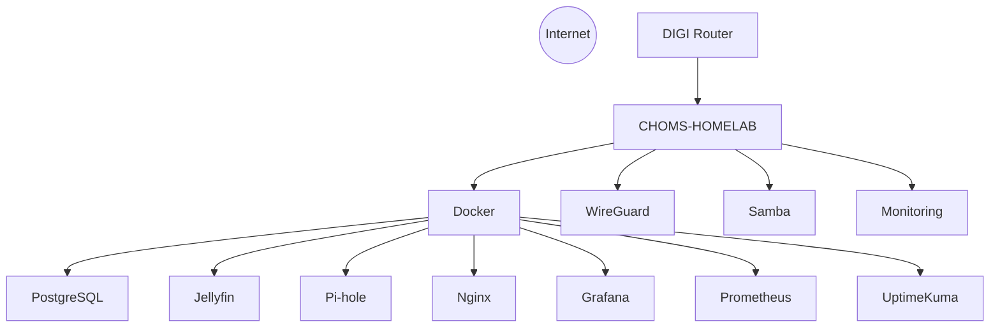

# CHOMS-HOMELAB

> **Production-inspired self-hosted infrastructure platform built with Debian, Docker and custom operational tooling.**


CHOMS-HOMELAB is a long-term self-hosted infrastructure project designed as a real-world Systems Administration, Infrastructure Engineering and DevOps laboratory.

The objective is not simply to run services, but to build a fully documented, version-controlled and reproducible platform.

---

# Current Status

| Area | Status |
|------|--------|
| Infrastructure | ✅ Completed |
| Networking | ✅ Completed |
| Security | ✅ Completed |
| Storage | ✅ Completed |
| Monitoring | ✅ Completed |
| Operations | 🚧 In Progress |
| Control Center | 📅 Planned |

---

# Architecture Overview



---

# Hardware

| Component | Specification |
|-----------|---------------|
| Platform | ACEPC AK2 Mini PC |
| CPU | Intel Celeron J3455 (4 Cores / 4 Threads) |
| Memory | 6 GB DDR3 |
| System SSD | 128 GB SATA SSD |
| CHOMS Data SSD | 960 GB SATA SSD |
| Media SSD | 240 GB SATA SSD |
| Shared HDD | 1 TB USB HDD (NTFS + exFAT) |
| Backup HDD | 2 TB External HDD |
| Network | Gigabit Ethernet |
| Operating System | Debian 13 (Trixie) |

---

# Storage Layout

```text
128 GB SSD
└── /
    Debian 13

960 GB SSD
└── /data
    Docker
    PostgreSQL
    Persistent Volumes
    Shared Storage

240 GB SSD
└── /media/ssd-media
    Media Library

1 TB HDD
├── /media/choms
└── /media/mac-win

2 TB HDD
└── Offline Backups
```

---

# Infrastructure

## Core
- Debian 13
- Docker
- Docker Compose

## Networking
- WireGuard
- Pi-hole
- Nginx

## Security
- UFW
- Fail2ban

## Storage
- Samba
- NTFS
- exFAT
- ext4

## Services
- PostgreSQL 17
- Jellyfin

## Monitoring
- Grafana
- Prometheus
- Node Exporter
- cAdvisor
- Uptime Kuma

## Operations
- CHOMS CLI
- CHOMS Doctor

---

# CHOMS CLI

```bash
choms doctor
choms storage
choms shares
choms docker
choms services
```

Future:

```bash
choms recycle
choms monitoring
choms backup
choms restore
choms vpn
```

---

# Project Goals

- Build production-inspired infrastructure.
- Learn by operating real services.
- Maintain everything as code.
- Produce professional documentation.
- Serve as a technical portfolio.

---

# Repository Structure

```text
docker/
docs/
scripts/
tools/
└── choms
```

---

# Documentation

Current documentation includes:

- Overview
- Hardware
- Network
- Security
- WireGuard
- Docker
- PostgreSQL
- Backups
- Roadmap
- Lessons Learned

---

# Roadmap

## Completed

- Debian
- Docker
- WireGuard
- Samba
- PostgreSQL
- Jellyfin
- Pi-hole
- Nginx
- Grafana
- Prometheus
- Node Exporter
- cAdvisor
- Uptime Kuma
- CHOMS Doctor
- CHOMS CLI

## Next

- Recovery Center
- Scrutiny
- Loki
- Alertmanager
- Nextcloud
- CHOMS Control Center

---

# Vision

CHOMS-HOMELAB is more than a homelab.

It is a production-inspired infrastructure platform where every service, automation and operational tool is documented, reproducible and version controlled.

---

# Author

**Oscar Salcedo**

Founder — CHOMS Master Technology Services

GitHub: https://github.com/ChomsMaster
