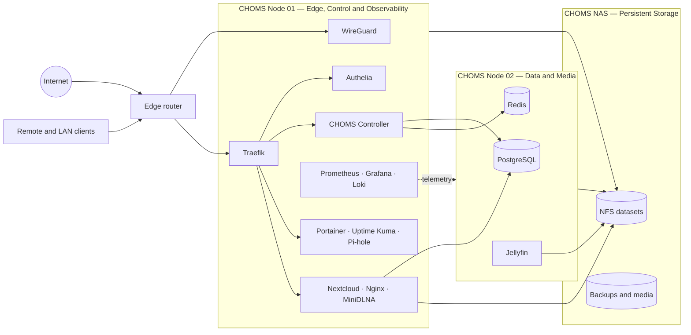

<div align="center">

# CHOMS-HOMELAB

### Production-inspired, multi-node self-hosted infrastructure

[](CHANGELOG.md)
[](docs/architecture/PLATFORM_TOPOLOGY_V2.md)
[](docker/compose.yml)
[](SECURITY.md)
[](docs/inventory/SERVICES.md)
[](LICENSE)

**Git as source of truth · Secure ingress · Centralized observability · Multi-node service placement · Documented operations**

[Architecture](#architecture) · [Services](#service-placement) · [Operations](#operations) · [Documentation](#documentation) · [Roadmap](ROADMAP.md)

</div>

---

## Overview

CHOMS-HOMELAB is a portfolio-grade infrastructure platform designed to apply production engineering practices to a real self-hosted environment. It combines Linux administration, container orchestration, secure remote access, monitoring, storage integration, operational tooling and architecture governance.

The v2 platform is intentionally distributed across two compute nodes and a dedicated NAS. Each component has a defined role, while the repository remains the canonical source for configuration, automation and documentation.

## Architecture


```mermaid
flowchart LR
    Internet((Internet))
    Clients[Remote and LAN clients]
    Router[Edge router]

    subgraph N1[CHOMS Node 01 — Edge, Control and Observability]
      WG[WireGuard]
      TF[Traefik]
      AU[Authelia]
      CTRL[CHOMS Controller]
      OBS[Prometheus · Grafana · Loki]
      OPS[Portainer · Uptime Kuma · Pi-hole]
      CLOUD[Nextcloud · Nginx · MiniDLNA]
    end

    subgraph N2[CHOMS Node 02 — Data and Media]
      PG[(PostgreSQL)]
      RD[(Redis)]
      JF[Jellyfin]
    end

    subgraph NAS[CHOMS NAS — Persistent Storage]
      NFS[(NFS datasets)]
      BKP[(Backups and media)]
    end

    Internet --> Router
    Clients --> Router
    Router --> WG
    Router --> TF
    TF --> AU
    TF --> CTRL
    TF --> OPS
    TF --> CLOUD
    CTRL --> PG
    CTRL --> RD
    CLOUD --> PG
    JF --> NFS
    CLOUD --> NFS
    N1 --> NFS
    N2 --> NFS
    OBS -. telemetry .-> N2
```

| Layer | Responsibility | Primary location |
|---|---|---|
| Edge and secure access | Reverse proxy, TLS, authentication, VPN and DNS | `choms-node-01` |
| Control plane | CHOMS Controller and operational tooling | `choms-node-01` |
| Observability | Metrics, logs, dashboards and uptime monitoring | `choms-node-01` |
| Data services | PostgreSQL and Redis | `choms-node-02` |
| Media workload | Jellyfin | `choms-node-02` |
| Persistent storage | NFS datasets, media and backup targets | NAS |

Detailed topology: [`docs/architecture/PLATFORM_TOPOLOGY_V2.md`](docs/architecture/PLATFORM_TOPOLOGY_V2.md)

## Service placement

### Node 01 — edge, control and observability

Traefik, Authelia, WireGuard, CHOMS Controller, Prometheus, Grafana, Loki, Promtail, Node Exporter, cAdvisor, Portainer, Uptime Kuma, Pi-hole, Nextcloud, Nginx, MiniDLNA and Scrutiny.

### Node 02 — data and media

PostgreSQL, Redis and Jellyfin.

### NAS — persistent storage

NFS-backed application data, media libraries and backup targets. Samba is not part of the current architecture; its former implementation remains only under [`docs/legacy`](docs/legacy) and [`scripts/legacy`](scripts/legacy) for historical traceability.

## Repository map

```text
CHOMS-HOMELAB/
├── apps/                    # CHOMS-owned applications
├── config/                  # Platform inventory and shared configuration
├── docker/                  # Compose definitions and service configuration
├── docs/
│   ├── architecture/        # Current platform design and ADRs
│   ├── governance/          # Decisions and versioning policy
│   ├── inventory/           # Nodes, services and storage inventory
│   ├── operations/          # Runbooks and operational procedures
│   ├── standards/           # Documentation and naming standards
│   ├── history/             # Milestones and superseded root documents
│   └── legacy/              # Retained v1 documentation
├── scripts/                 # Bootstrap, maintenance and deployment automation
├── stacks/                  # Node-specific deployable stacks
├── tools/                   # CHOMS CLI and diagnostics
├── PROJECT_STATUS.md        # Current implementation state
└── ROADMAP.md               # Prioritized platform evolution
```

## Operations

The `choms` command is the preferred operational entry point:

```bash
choms health
choms status
choms doctor
choms compose config
choms compose ps
choms service list
choms service status <service>
choms service logs <service>
```

Deployment and validation guidance:

- [`docs/operations/DEPLOY.md`](docs/operations/DEPLOY.md)
- [`docs/operations/OPERATIONS_MANUAL.md`](docs/operations/OPERATIONS_MANUAL.md)
- [`docs/operations/TROUBLESHOOTING.md`](docs/operations/TROUBLESHOOTING.md)
- [`docs/operations/INCIDENT_RESPONSE.md`](docs/operations/INCIDENT_RESPONSE.md)

## Security model

- SSH key authentication only; root login and password authentication disabled.
- UFW host firewall and Fail2ban protection.
- Traefik-managed HTTPS ingress.
- Authelia protection for administrative web services.
- WireGuard for remote and node connectivity.
- Secrets and runtime state excluded from Git.
- `.env.example` files document required variables without shipping credentials.

See [`SECURITY.md`](SECURITY.md) and [`docs/architecture/SECURITY_ARCHITECTURE.md`](docs/architecture/SECURITY_ARCHITECTURE.md).

## Documentation

| Document | Purpose |
|---|---|
| [`SYSTEM_OVERVIEW.md`](SYSTEM_OVERVIEW.md) | Concise platform overview |
| [`PROJECT_STATUS.md`](PROJECT_STATUS.md) | Verified current state and active work |
| [`ROADMAP.md`](ROADMAP.md) | Prioritized evolution plan |
| [`docs/inventory/NODES.md`](docs/inventory/NODES.md) | Compute-node inventory |
| [`docs/inventory/SERVICES.md`](docs/inventory/SERVICES.md) | Service ownership and placement |
| [`docs/inventory/STORAGE.md`](docs/inventory/STORAGE.md) | Storage responsibilities |
| [`docs/architecture/ADR`](docs/architecture/ADR) | Architecture decision records |
| [`REFACTOR_REPORT_V2.md`](REFACTOR_REPORT_V2.md) | v2 repository refactor record |

## Project principles

1. **Git is the source of truth.** Runtime state and secrets never become repository configuration.
2. **Node roles are explicit.** Services are placed according to operational responsibility, not convenience.
3. **Changes are reversible.** Deployments require validation and rollback paths.
4. **Operations are documented.** A service is incomplete without monitoring, recovery and ownership guidance.
5. **Security is layered.** Network, host, identity and application controls reinforce each other.

## Current release

The repository is prepared for the `v2.0.0` release line. The v1 baseline remains available through Git history and the material retained under `docs/legacy/v1`.

## Author

**Oscar Salcedo**  
Founder — CHOMS Master Technology Services

---

<div align="center">
Built as infrastructure, operated as a platform, documented as an engineering system.
</div>
