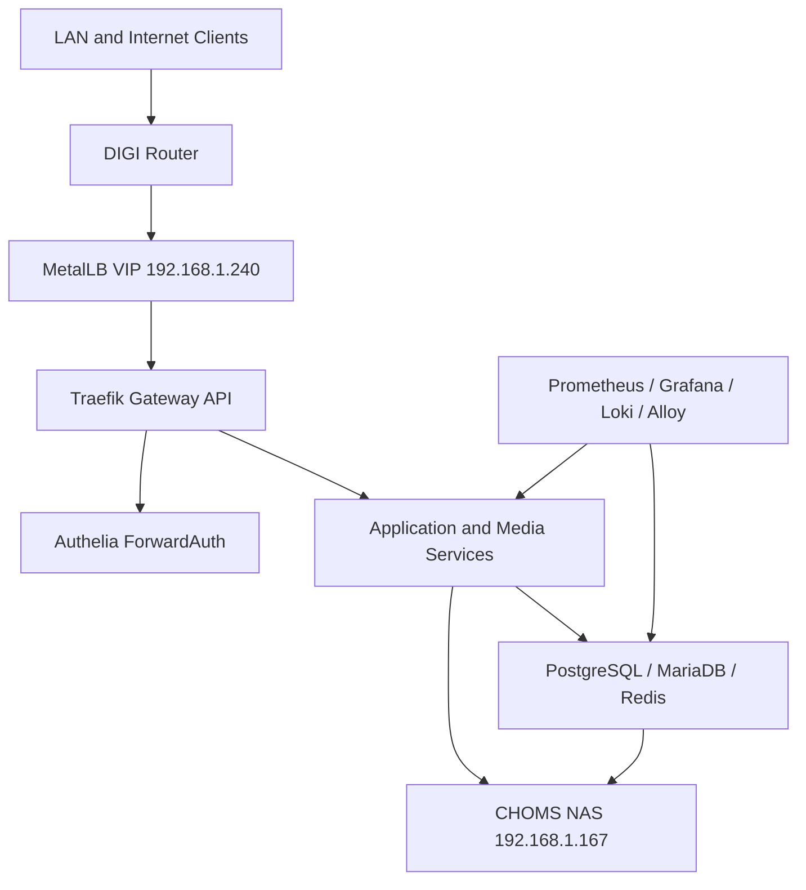

# CHOMS-HOMELAB

> Production-inspired self-hosted Kubernetes platform built with Debian,
> K3s, Traefik, Authelia, observability and Git-based desired-state management.


## What is CHOMS-HOMELAB?

CHOMS-HOMELAB is a long-term infrastructure project designed as a real-world
Systems Administration, Infrastructure Engineering and DevOps laboratory.

The goal is not simply to run services. The goal is to build, operate and
document a reproducible platform with production-inspired practices:

- Kubernetes orchestration with K3s
- Infrastructure as code mindset
- Git as the desired-state source of truth
- Secure public and private service exposure
- Centralized authentication
- Monitoring and centralized logging
- Persistent NFS storage
- Operational validation and recovery
- Documented engineering decisions and roadmap

## Current Status

| Area | Status |
|---|---|
| Three-node K3s cluster | Operational |
| Git desired state | Versioned |
| MetalLB and Traefik edge | Operational |
| Gateway API and HTTPS routing | Operational |
| Authelia authentication | Operational |
| NFS persistent storage | Operational |
| Monitoring and centralized logging | Operational |
| Direct Kubernetes workloads | Versioned |
| Locked Helm releases | Validated |
| Runtime declarative coverage | 35 of 35 workloads |
| Backup and recovery validation | Next priority |

Current cluster:

| Node | Address | Role |
|---|---|---|
| `choms-node-01` | `192.168.1.138` | K3s control plane |
| `choms-node-02` | `192.168.1.172` | K3s worker |
| `choms-node-03` | `192.168.1.134` | K3s worker |

## High-Level Architecture


```mermaid
flowchart TD
    Clients[LAN and Internet Clients]
    Router[DIGI Router]
    VIP[MetalLB VIP 192.168.1.240]
    Traefik[Traefik Gateway API]
    Authelia[Authelia ForwardAuth]
    Apps[Application and Media Services]
    Data[PostgreSQL / MariaDB / Redis]
    Observe[Prometheus / Grafana / Loki / Alloy]
    NAS[CHOMS NAS 192.168.1.167]

    Clients --> Router
    Router --> VIP
    VIP --> Traefik
    Traefik --> Authelia
    Traefik --> Apps
    Apps --> Data
    Apps --> NAS
    Data --> NAS
    Observe --> Apps
    Observe --> Data
```

## Platform Endpoints

### Public

- `https://chomsmaster.com`
- `https://www.chomsmaster.com`

### Authentication and Platform

- `https://auth.chomsmaster.com`
- `https://home.chomsmaster.com`
- `https://controller.chomsmaster.com`
- `https://grafana.chomsmaster.com`
- `https://prometheus.chomsmaster.com`
- `https://kuma.chomsmaster.com`
- `https://scrutiny.chomsmaster.com`

### Applications and Media

- `https://nextcloud.chomsmaster.com`
- `https://jellyfin.chomsmaster.com`
- `https://threadfin.chomsmaster.com`
- `https://fbrowser.chomsmaster.com`
- `https://torrent.chomsmaster.com`
- `https://portainer.chomsmaster.com`

Applications use their native authentication or Authelia ForwardAuth
according to their route and security requirements.

## Technology Stack

### Base Infrastructure

- Debian 13
- K3s `v1.36.2+k3s1`
- containerd
- Three-node Kubernetes cluster
- NFS-backed persistent storage

### Networking and Security

- MetalLB
- Traefik
- Kubernetes Gateway API
- cert-manager
- Let's Encrypt
- Authelia ForwardAuth
- CoreDNS split DNS
- WireGuard

### Monitoring and Observability

- Prometheus
- Alertmanager
- Grafana
- Loki
- Alloy
- kube-state-metrics
- Node Exporter
- Uptime Kuma
- Scrutiny

### Data and Applications

- PostgreSQL
- MariaDB
- Redis
- Nextcloud
- Jellyfin
- Threadfin
- Filebrowser
- qBittorrent
- Portainer
- CHOMS Controller

### Declarative Operations

- Direct Kubernetes manifests
- Locked Helm chart versions
- Versioned Helm values
- Images pinned by digest
- Local Kubernetes Secret bootstrap
- Git-based desired-state management

## Declarative Platform Architecture

Kubernetes desired state is organized by platform component:

```text
stacks/kubernetes/
├── apps/
├── authelia/
├── cert-manager/
├── coredns/
├── databases/
├── filebrowser/
├── helm/
├── home/
├── jellyfin/
├── logging/
├── metallb/
├── monitoring/
├── nfs-provisioner/
├── qbittorrent/
├── routes/
├── scrutiny/
├── secrets/
├── security/
├── threadfin/
└── traefik/
```

Direct manifests describe application resources. Versioned values describe
Helm-managed components. MetalLB uses a vendored upstream native manifest.

## Locked Helm Releases

| Release | Namespace | Chart version |
|---|---|---|
| `choms-nfs` | `nfs-provisioner` | `4.0.18` |
| `cert-manager` | `cert-manager` | `v1.21.1` |
| `traefik-k8s` | `traefik` | `41.1.0` |
| `choms-monitoring` | `monitoring` | `88.0.1` |
| `choms-loki` | `logging` | `18.7.1` |
| `choms-alloy` | `logging` | `1.11.0` |

Validate all locked releases without changing their revisions:

```bash
./stacks/kubernetes/helm/apply-releases.sh plan
```

Apply only after reviewing a successful plan:

```bash
./stacks/kubernetes/helm/apply-releases.sh apply
```

## Secret Management

Secret values are excluded from Git. Kubernetes Secrets are generated from
the ignored local environment file:

```bash
./stacks/kubernetes/secrets/apply-secrets.sh
```

The local `stacks/kubernetes/secrets/secrets.env` file must never be
committed.

## Operational Validation

Cluster health:

```bash
kubectl get nodes
kubectl get pods -A
kubectl get deployment,statefulset,daemonset -A
kubectl get pvc -A
kubectl get gateway,httproute -A
helm list -A
```

Validate a direct manifest before applying it:

```bash
kubectl apply --dry-run=server -f <manifest>
kubectl diff -f <manifest>
kubectl apply -f <manifest>
```

Expected platform state:

- Three nodes Ready
- No unhealthy Pods
- Persistent volume claims Bound
- Traefik Gateway programmed at `192.168.1.240`
- Six Helm releases deployed
- Zero runtime workloads without identified declarative ownership

Legacy Docker-oriented CHOMS CLI tooling remains in the repository as
engineering history and may be reused where appropriate, but it is no longer
the deployment model for the Kubernetes platform.

## Roadmap

### Phase 1 — Foundation Infrastructure

Status: Completed

Delivered:

- Debian infrastructure baseline
- Git source-of-truth model
- Initial service deployment and operational tooling
- Authentication, HTTPS and observability foundation
- NAS integration and network validation

### Phase 2 — Kubernetes Platform

Status: Operational

Delivered:

- Three-node K3s cluster
- MetalLB stable edge address
- Traefik Gateway API
- cert-manager TLS automation
- Authelia ForwardAuth
- NFS dynamic provisioning
- Core application and database workloads
- Prometheus, Grafana, Loki and Alloy
- Locked Helm release installer
- Declarative runtime coverage audit

### Phase 3 — Resilience and Recovery

Status: Current priority

Planned:

- PVC and NAS backup validation
- Controlled restoration tests
- Database-aware backup procedures
- Node replacement procedures
- Storage and capacity alerts
- Disaster-recovery exercises

### Phase 4 — Platform Automation

Planned:

- Continuous declarative drift detection
- CI validation for manifests and Helm values
- Automated policy checks
- Scheduled recovery verification
- GitOps evaluation
- Infrastructure provisioning automation

See [`ROADMAP.md`](ROADMAP.md) for the active engineering roadmap.

## Project Goal

CHOMS-HOMELAB is intended to be a practical, portfolio-grade platform
demonstrating:

- Linux and Kubernetes administration
- Container orchestration
- Networking and secure ingress
- Identity-aware application access
- Persistent storage management
- Monitoring and centralized logging
- Declarative infrastructure management
- Automation and operational safety
- Backup and recovery engineering
- Technical documentation and architecture governance

## Author

Oscar Salcedo  
Founder — CHOMS Master Technology Services
