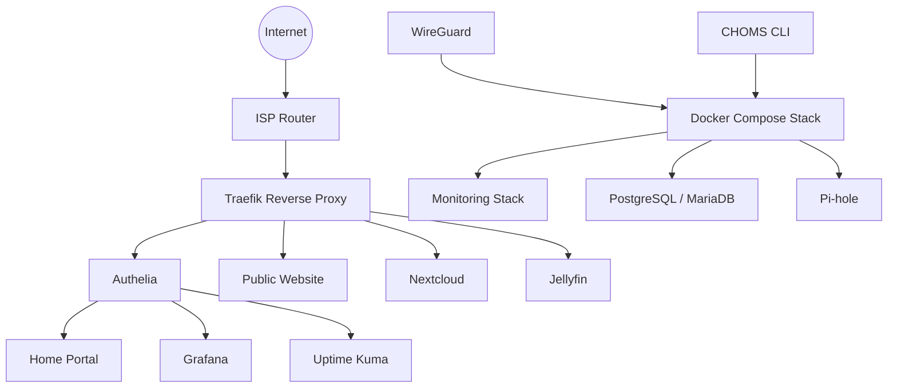
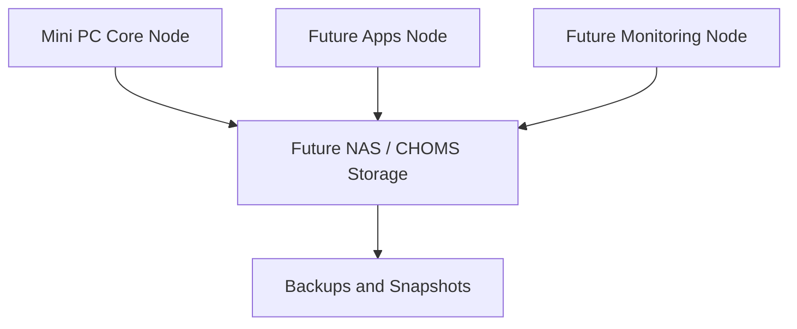

# CHOMS-HOMELAB System Overview

## Purpose

CHOMS-HOMELAB is a production-inspired self-hosted infrastructure platform.

It is designed to be:

- practical
- documented
- version-controlled
- reproducible
- secure by default
- ready to evolve into a multi-node platform

## Current Architecture



## Current Host Role

The current server acts as the first CHOMS node.

Current responsibilities:

- reverse proxy
- authentication
- public website
- application hosting
- monitoring
- database hosting
- DNS filtering
- VPN endpoint
- operational control

## Public and Private Access Model

### Public

- `chomsmaster.com`
- `www.chomsmaster.com`

### Authentication

- `auth.chomsmaster.com`

### Protected

- `home.chomsmaster.com`
- `grafana.chomsmaster.com`
- `kuma.chomsmaster.com`
- `traefik.chomsmaster.com`

### Native Login

- `cloud.chomsmaster.com`
- `jellyfin.chomsmaster.com`

## Operational Model

Primary operational command:

```bash
choms
```

Key commands:

```bash
choms health
choms status
choms version
choms urls
choms compose ps
choms service list
choms logs <service>
choms restart <service>
choms update
choms vault list
```

## Storage Model

Current storage is local to the host.

Planned Phase 2 storage model:



The future architecture will separate:

- compute nodes
- storage
- backups
- monitoring

## Future Architecture Direction

CHOMS is expected to evolve toward:

- dedicated NAS
- 3–4 mini PC nodes
- managed switch
- OPNsense / pfSense firewall
- VLAN segmentation
- backup and restore automation
- CI/CD
- K3s evaluation
- service placement strategy

## Current Phase

Phase 1 is complete.

Next phase:

**Phase 2 — Backups, resilience and recovery**
