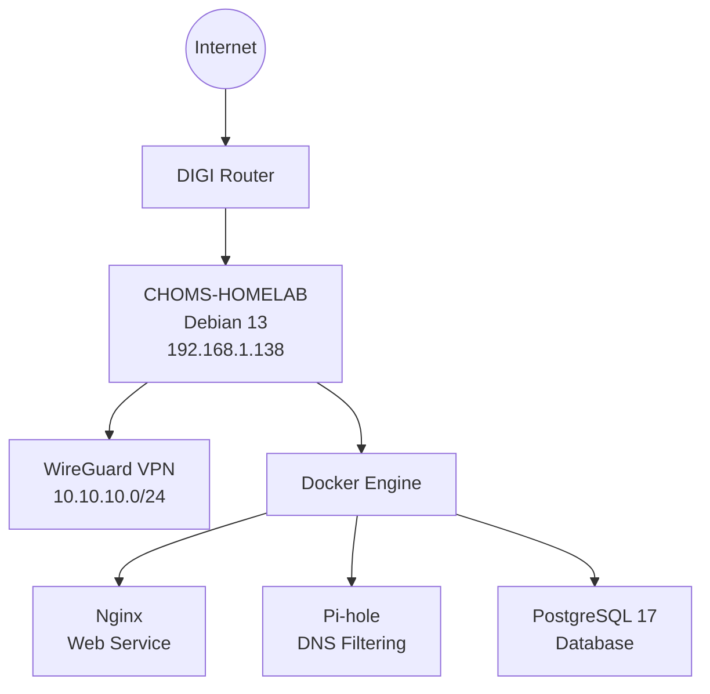

# Network Architecture

```mermaid
flowchart TD
    Internet((Internet))
    Router[DIGI Router]
    Server[CHOMS-HOMELAB<br/>Debian 13<br/>192.168.1.138]

    WG[WireGuard VPN<br/>10.10.10.0/24]
    Docker[Docker Engine]
    Nginx[Nginx<br/>Web Service]
    Pihole[Pi-hole<br/>DNS Filtering]
    Postgres[PostgreSQL 17<br/>Database]

    Internet --> Router
    Router --> Server
    Server --> WG
    Server --> Docker
    Docker --> Nginx
    Docker --> Pihole
    Docker --> Postgres
```
