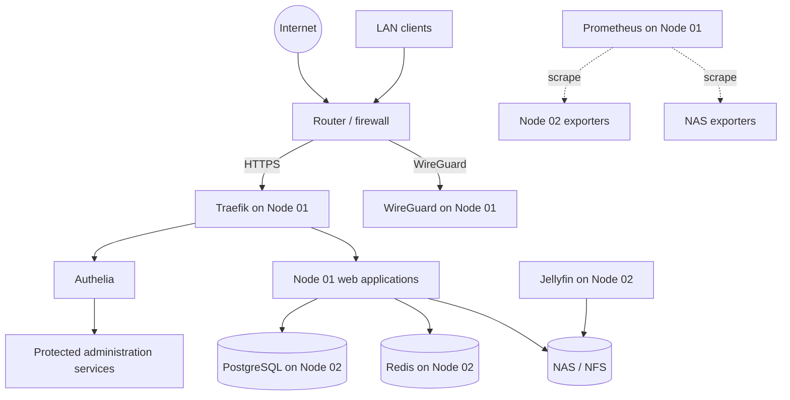

# CHOMS Platform Topology v2

## Purpose

This document is the canonical architecture reference for the deployed CHOMS-HOMELAB v2 platform.

## Physical and logical roles

| Node | Role | Workloads |
|---|---|---|
| `choms-node-01` | Edge, control and observability | Traefik, Authelia, WireGuard, CHOMS Controller, monitoring, administration, Nextcloud, Nginx, Pi-hole and MiniDLNA |
| `choms-node-02` | Data and media | PostgreSQL, Redis and Jellyfin |
| NAS | Persistent storage | NFS datasets, media and backup targets |

## Traffic principles

1. Public HTTP traffic terminates at Traefik on Node 01.
2. Administrative applications use Authelia where application-native authentication is insufficient.
3. Data-plane connections from Node 01 applications to PostgreSQL and Redis stay on trusted internal networks or VPN paths.
4. Persistent datasets are mounted from the NAS through NFS.
5. Monitoring is centralized on Node 01 and collects telemetry from all infrastructure components.

## Placement rules

- Edge and identity services remain on Node 01.
- Stateful databases remain on Node 02 unless an approved ADR changes placement.
- Large persistent datasets remain on the NAS.
- A service cannot be promoted to production without monitoring, backup and recovery documentation.

## Protected components

The v2 repository refactor does not alter production WireGuard or CHOMS Controller behavior. Their documentation may be clarified, but functional configuration changes require a separate reviewed change.
